# Implementation Plan: Hackathon Zero-ETH Claim

> Derived from `design.md` and `requirements.md` in this same directory. Authoritative project plan: `../../../implementation_plan.md`.
>
> Tasks are grouped by tier and ordered to match the phase numbers in the implementation plan. Each leaf task lists explicit `Depends on:` and `Validates: Requirements X.Y` so the orchestrator can dispatch them in dependency order.
>
> **Tier-gating rule**: do not start a Tier 2 task until all Tier 1 tasks are complete. Do not start a Tier 3 task until 5A, 5B, 5C, 5D, 5E (Tier 2) are complete.

## Overview

This implementation plan turns the design and requirements into a wave-scheduled backlog. Tier 1 (mandatory) is broken into Stream A (no testnet uptime needed) and Stream B (requires the funded Base Sepolia deployer wallet). Stream A dispatches first; Stream B fires once 1.6 (deploy) and 1.7 (seed) are runnable. Tier 2 differentiators wait for 4.3 (Tier 1 gate). Tier 3 stretch waits for 5.12 (Tier 2 gate).

## Task Dependency Graph

The waves below are the orchestrator's dispatch schedule. Tasks within the same wave can run in parallel; later waves wait for prior waves to close.

```json
{
  "waves": [
    {
      "name": "Wave 1 — Stream A unblocked infra (parallel)",
      "tasks": ["1.1", "1.2", "1.3", "1.5", "2.1", "2.2", "3.1"]
    },
    {
      "name": "Wave 2 — Stream A dependent infra (parallel)",
      "tasks": ["1.4", "2.3", "3.2"]
    },
    {
      "name": "Wave 3 — Stream B Base Sepolia deploy (sequential, human-gated on faucet)",
      "tasks": ["1.6", "1.7"]
    },
    {
      "name": "Wave 4 — Tier 1 UGF wiring (sequential)",
      "tasks": ["3.3", "3.4"]
    },
    {
      "name": "Wave 5 — Tier 1 demo close-out",
      "tasks": ["4.1", "4.2", "4.3"]
    },
    {
      "name": "Wave 6 — Tier 2 wrap-all-flows + toggle (parallel after 5.1)",
      "tasks": ["5.1", "5.2", "5.3", "5.4", "5.5"]
    },
    {
      "name": "Wave 7 — Tier 2 differentiators (parallel)",
      "tasks": ["5.6", "5.7", "5.8", "5.9", "5.10", "5.11"]
    },
    {
      "name": "Wave 8 — Tier 2 gate",
      "tasks": ["5.12"]
    },
    {
      "name": "Wave 9 — Tier 3 stretch (optional, parallel)",
      "tasks": ["6.1", "6.2", "6.3", "6.4"]
    }
  ]
}
```

The Mermaid diagram below visualizes the same dependencies for human review.

```mermaid
graph TD
  subgraph "Tier 1 — Mandatory"
    T1A["1A: hardhat.config baseSepolia"]
    T1F["1F: package.json scripts"]
    T1C["1C: VITE_NETWORK_MODE + Base Sepolia chain id"]
    T1D["1D: Web3Context Base Sepolia branch"]
    T1E_code["1E: write seedDemo.js (idempotent)"]
    T1B["1B: deploy:base on Base Sepolia"]
    T1E_run["1E: run seed:base"]
    T2A["2A: OwnerDashboard.jsx"]
    T2B["2B: InvestorDashboard.jsx (no UGF yet)"]
    T2C["2C: Role-aware routing + navbar"]
    T3A["3A: install @tychilabs/react-ugf"]
    T3B["3B: UGFContext.jsx skeleton + main.jsx mount"]
    T3C["3C: UGF-wrap claimAll in InvestorDashboard"]
    T3D["3D: Gas-in-Mock-USD badge + CSS"]
    T4A["4A: E2E demo verification on Base Sepolia"]
    T4B["4B: Record 60-second demo"]

    T1A --> T1B
    T1B --> T1E_run
    T1E_code --> T1E_run
    T1C --> T1D
    T1D --> T3C
    T2B --> T2C
    T2A --> T2C
    T2B --> T3C
    T3A --> T3B
    T3B --> T3C
    T3C --> T3D
    T1E_run --> T4A
    T2C --> T4A
    T3D --> T4A
    T4A --> T4B
  end

  subgraph "Tier 2 — Differentiators"
    T5A1["5A.1: ugfExecute generic helper"]
    T5A2["5A.2: UGF-wrap depositRental"]
    T5A3["5A.3: UGF-wrap buyFromOwner"]
    T5A4["5A.4: UGF-wrap buyFromListing + cancelListing"]
    T5B["5B: UGF on/off toggle"]
    T5C_be["5C: backend POST validation + filter"]
    T5C_fe["5C: ActivityFeed component + logTx hook"]
    T5D["5D: CostBanner component"]
    T5E["5E: Rename Dividends → Claim Rent"]
    T5F["5F: FaucetPanel + /api/faucet/usdc"]
    T5G["5G: Brand pass (name, logo, landing)"]

    T4A --> T5A1
    T5A1 --> T5A2
    T5A1 --> T5A3
    T5A1 --> T5A4
    T5A1 --> T5B
    T5A1 --> T5C_fe
    T5C_fe --> T5C_be
    T5A1 --> T5D
    T4A --> T5E
    T4A --> T5F
    T4A --> T5G
  end

  subgraph "Tier 3 — Stretch"
    T6A["6A: Embedded wallet (Privy)"]
    T6B["6B: ClaimReceipt soulbound NFT"]
    T6C["6C: Pitch video"]
    T6D["6D: Live demo URL"]

    T5A4 --> T6A
    T5A4 --> T6B
    T5G --> T6C
    T5G --> T6D
  end

  style T1A fill:#1e3a5f
  style T1F fill:#1e3a5f
  style T1C fill:#1e3a5f
  style T1D fill:#1e3a5f
  style T1B fill:#1e3a5f
  style T1E_code fill:#1e3a5f
  style T1E_run fill:#1e3a5f
  style T2A fill:#2d4a2d
  style T2B fill:#2d4a2d
  style T2C fill:#2d4a2d
  style T3A fill:#5a2d5a
  style T3B fill:#5a2d5a
  style T3C fill:#5a2d5a
  style T3D fill:#5a2d5a
  style T4A fill:#4a3a1a
  style T4B fill:#4a3a1a
  style T5A1 fill:#3a5a1a
  style T5A2 fill:#3a5a1a
  style T5A3 fill:#3a5a1a
  style T5A4 fill:#3a5a1a
  style T5B fill:#3a5a1a
  style T5C_be fill:#3a5a1a
  style T5C_fe fill:#3a5a1a
  style T5D fill:#3a5a1a
  style T5E fill:#3a5a1a
  style T5F fill:#3a5a1a
  style T5G fill:#3a5a1a
  style T6A fill:#5a4a1a
  style T6B fill:#5a4a1a
  style T6C fill:#5a4a1a
  style T6D fill:#5a4a1a
```



## Tasks

- [x] 1. Tier 1 — Infrastructure & deploy
  - [x] 1.1 Verify `baseSepolia` network entry in `hardhat.config.js`
    - Confirm the existing `baseSepolia` block in `hardhat.config.js` resolves `BASE_SEPOLIA_RPC_URL` from `.env`, sets `chainId: 84532`, and reads `PRIVATE_KEY` (without `0x` prefix).
    - Confirm `etherscan.apiKey.baseSepolia` is wired to `BASESCAN_API_KEY`.
    - Run `npx hardhat compile` to ensure the network registration didn't break compilation.
    - **Files**: `hardhat.config.js` (read/verify only).
    - **Depends on**: nothing.
    - **Validates**: Requirements 1.1, 1.5.

  - [x] 1.2 Add convenience scripts to root `package.json`
    - Add (or verify): `compile`, `test`, `node`, `deploy:local`, `deploy:base`, `seed:base`, `simulate`, `dev:frontend`, `dev:backend`.
    - The `seed:base` script must run `hardhat run scripts/seedDemo.js --network baseSepolia` (script body lands in task 1.5).
    - **Files**: `package.json`.
    - **Depends on**: nothing.
    - **Validates**: Requirements 2.1.

  - [x] 1.3 Add `VITE_NETWORK_MODE` toggle and Base Sepolia constants in `frontend/src/config/contracts.js`
    - Replace the hard-coded `NETWORK_CHAIN_ID` with one resolved at runtime from `import.meta.env.VITE_NETWORK_MODE` (`local` → `31337`, `baseSepolia` → `84532`; default `baseSepolia`).
    - Add `BASE_SEPOLIA_RPC_URL` constant resolved from `import.meta.env.VITE_BASE_SEPOLIA_RPC_URL` falling back to `https://sepolia.base.org`.
    - Add `VITE_BACKEND_URL` resolution (defaults `http://localhost:5000`).
    - Keep existing `LOCAL_RPC_URL` and `SEPOLIA_RPC_URL`.
    - Re-export `CONTRACT_ADDRESSES` populated either from `deployed-addresses.json` shape or from `import.meta.env.VITE_MOCK_USDC_ADDRESS` / `VITE_PROPERTY_FACTORY_ADDRESS`. Until task 1.4 deploys, keep the hardcoded localhost addresses as a fallback.
    - Document the new env vars in `.env.example` (already done; verify only).
    - **Files**: `frontend/src/config/contracts.js`, `frontend/.env.example` (create if missing).
    - **Depends on**: nothing.
    - **Validates**: Requirements 1.2.

  - [x] 1.4 Add Base Sepolia branch to `Web3Context.getExpectedNetworkConfig()` and `getReadProvider()`
    - In `frontend/src/context/Web3Context.jsx`, add a `NETWORK_CHAIN_ID === 84532` branch in `getExpectedNetworkConfig()` returning `chainIdHex: "0x14a34"`, name `Base Sepolia`, native ETH, RPC = `BASE_SEPOLIA_RPC_URL`, explorer `https://sepolia.basescan.org`.
    - Modify `getReadProvider()` to use `BASE_SEPOLIA_RPC_URL` when `NETWORK_CHAIN_ID === 84532`, otherwise existing `LOCAL_RPC_URL`.
    - Do NOT introduce any UGF coupling here. `Web3Context` stays UGF-unaware (Property 7 of design).
    - **Files**: `frontend/src/context/Web3Context.jsx`.
    - **Depends on**: 1.3.
    - **Validates**: Requirements 1.3, 1.4.

  - [x] 1.5 Write `scripts/seedDemo.js` (idempotent)
    - Connect to `baseSepolia` via Hardhat. Read `deployed-addresses.json` for factory + USDC addresses. Read `DEMO_INVESTOR_PRIVATE_KEY` and `DEMO_INVESTOR_WALLET_ADDRESS` from `.env` (fail fast if missing).
    - Steps in order: approve marketplace per property; mint 1,000 USDC to demo investor; demo investor buys 30 PROP from property #0; deployer approves rentalDistribution and deposits 1,000 USDC of rent.
    - Idempotency check before steps: if `propertyToken.balanceOf(demoInvestor) >= 30` AND there is at least one epoch where `rental.claimed(0, demoInvestor) === false` AND pending > 0, skip the seed actions and only print the summary.
    - At exit, print a "Demo investor wallet" block with address, ETH balance, USDC balance, PROP balance, pending dividends.
    - When `BASE_SEPOLIA_GAS_DUST_ADDRESS` is set, sweep the demo investor's residual ETH to that address; otherwise print "manual sweep needed".
    - Append `demoInvestor` and `demoOwner` keys to `deployed-addresses.json` (preserving existing keys).
    - **Files**: `scripts/seedDemo.js` (new), `deployed-addresses.json` (append).
    - **Depends on**: nothing for writing the script. Running the script depends on 1.6.
    - **Validates**: Requirements 2.1, 2.2, 2.3, 2.4, 2.5, 2.6, 2.7, 2.8, 2.9.

  - [x] 1.6 Deploy contracts to Base Sepolia (`npm run deploy:base`)
    - Run `npx hardhat run scripts/deploy.js --network baseSepolia` (or the npm alias). Capture the printed addresses.
    - Verify `deployed-addresses.json` updates with `network: "baseSepolia"`, `mockUsdc`, `factory`, `deployedAt`.
    - Update `frontend/src/config/contracts.js` `CONTRACT_ADDRESSES` to point at the new addresses (or rely on env vars from 1.3 — pick one path).
    - Pre-condition (human): deployer wallet must hold ≥ 0.05 Base Sepolia ETH at `0xa7Fa1328…BC3b`.
    - **Files**: `deployed-addresses.json` (overwritten by deploy.js), `frontend/src/config/contracts.js` (addresses updated).
    - **Depends on**: 1.1, 1.2, 1.3, 1.4. Human pre-condition: faucet funds confirmed.
    - **Validates**: Requirements 1.1, 6.1.

  - [x] 1.7 Run `npm run seed:base` and verify demo wallet manifest
    - Execute the script; confirm the printed wallet summary shows `USDC ≥ 700`, `PROP = 30`, `pending > 0`, `ETH = 0` (or "manual sweep needed").
    - Run the script a second time; confirm idempotency (no double-buy, no double-deposit).
    - **Files**: none authored; verifies 1.5 and 1.6 outputs.
    - **Depends on**: 1.5, 1.6.
    - **Validates**: Requirements 2.6, 2.7.

- [x] 2. Tier 1 — Role-based dashboards
  - [x] 2.1 Build `OwnerDashboard.jsx`
    - Route `/owner`. Gate: if not connected, render "Connect Wallet" prompt; if `roleHint !== "Owner"`, redirect to `/investor`.
    - Iterate `factory.getPropertiesCount()` and filter `properties[i].owner === account`.
    - Per owned property show: name, location, total rent deposited (sum of epoch amounts via `rental.epochCount()` + `rental.getEpoch(i)`), remaining unsold supply (`100 - sum of holders other than owner`), most-recent 5 epochs.
    - **Deposit Rental Income** form: USDC amount input. Two-tx flow in Tier 1 — `usdc.approve(rentalAddr, amount)` then `rental.depositRental(amount)`. Use existing `getUsdc()` and `getPropertyContracts()` helpers from `Web3Context`.
    - **Create New Property** button calls `factory.createProperty(name, location, valueInr, pricePerToken)`.
    - Refresh on success: `refreshUsdcBalance()` plus a local re-fetch of the property's epochs.
    - **Files**: `frontend/src/pages/OwnerDashboard.jsx` (new).
    - **Depends on**: nothing (uses existing Web3Context API).
    - **Validates**: Requirements 3.1, 3.2, 3.3, 3.5, 3.8.

  - [x] 2.2 Build `InvestorDashboard.jsx` (with normal `claimAll` first; UGF wraps in 3.3)
    - Route `/investor`. Gate: if not connected, render "Connect Wallet" prompt.
    - Hero: total pending dividends across all properties, formatted with `fmtUsdc`.
    - Per-property cards for properties where `token.balanceOf(account) > 0`: show tokens held, ownership %, pending USDC.
    - Single **⚡ Claim All Rent** button. In this task it calls `rental.claimAll()` directly — UGF wrap is done in task 3.3.
    - Link to `/property/:address` for each card; link to `Home.jsx` for browse.
    - Refresh after claim: `refreshUsdcBalance()` + local re-read of `pendingDividends(account)`.
    - **Files**: `frontend/src/pages/InvestorDashboard.jsx` (new).
    - **Depends on**: nothing.
    - **Validates**: Requirements 3.1, 3.2, 3.4, 3.9.

  - [x] 2.3 Wire role-aware routing and navbar in `App.jsx`
    - Add routes `/owner` and `/investor`.
    - Navbar links: `Connect Wallet` when no account; `Dashboard → /owner` when `roleHint === "Owner"`; `Dashboard → /investor` when `roleHint === "Investor"`. Keep existing Properties / Portfolio / Dividends links.
    - Remove the "Switch Account" button from the main navbar (its handler can stay in `Web3Context` for future use).
    - Existing routes (`/`, `/property/:address`, `/portfolio`, `/dividends`) MUST continue to render unchanged.
    - **Files**: `frontend/src/App.jsx`.
    - **Depends on**: 2.1, 2.2.
    - **Validates**: Requirements 3.1, 3.3, 3.4, 3.6, 3.7.

- [x] 3. Tier 1 — UGF integration
  - [x] 3.1 Install `@tychilabs/react-ugf` in frontend
    - Run `npm install @tychilabs/react-ugf` inside `frontend/`.
    - Capture the installed version into `frontend/package.json` (no caret pin if the README indicates the API may move; prefer pinning the exact version).
    - **Files**: `frontend/package.json`, `frontend/package-lock.json`.
    - **Depends on**: nothing.
    - **Validates**: Requirements 4.1.

  - [x] 3.2 Build `UGFContext.jsx` skeleton and mount provider
    - Create `frontend/src/context/UGFContext.jsx` exposing `useUGF()` with `openUGF`, `ugfExecute(target, abi, fnName, args, opts?)`, `getQuote(target, abi, fnName, args)`, `isUGFEnabled` (default `true`), `setUGFEnabled`, and a `logTx(...)` no-op stub for Tier 2 / 5C.
    - `ugfExecute` borrows `signer` from `useWeb3()`. When `isUGFEnabled === true`, it relays via `openUGF({ signer, tx, destChainId: "84532" })`. When false, it falls through to `signer.sendTransaction(tx)`.
    - `getQuote` is a thin wrapper around the SDK quote API; if the SDK doesn't expose a quote method, return `null` and document the gap. Do not invent an API.
    - In `frontend/src/main.jsx`, wrap the app: `<UGFProvider>` (from the SDK) outside `<Web3Provider>`; our `<UGFContextProvider>` (this task) inside `<Web3Provider>` so it can read `signer`.
    - `Web3Context.jsx` MUST NOT import `@tychilabs/react-ugf` (Property 7).
    - Verify the live SDK README before coding — `useUGFModal().openUGF()` shape may have changed.
    - **Files**: `frontend/src/context/UGFContext.jsx` (new), `frontend/src/main.jsx`.
    - **Depends on**: 3.1.
    - **Validates**: Requirements 4.1, 4.2, 4.3, 4.4, 4.5, 4.6.

  - [x] 3.3 UGF-wrap `claimAll` in `InvestorDashboard.jsx`
    - Replace the direct `rental.claimAll()` call in 2.2 with `ugfExecute(prop.rentalDistribution, RENTAL_DISTRIBUTION_ABI, "claimAll", [])`.
    - Iterate over the per-property cards: one `ugfExecute` per property where pending > 0 (or one bulk button per property; choose one and document).
    - On rejection from UGF (insufficient `TYI_MOCK_USD`, signed-tx failure, on-chain revert): surface a toast with the rejection reason. Do NOT auto-fall-back to direct signer (Property 4 / Requirement 5.5).
    - On success: re-read `pendingDividends(account)` and refresh USDC balance.
    - **Files**: `frontend/src/pages/InvestorDashboard.jsx`.
    - **Depends on**: 2.2, 3.2, 1.4.
    - **Validates**: Requirements 5.1, 5.2, 5.3, 5.5.

  - [x] 3.4 Add gas-in-Mock-USD badge and CSS
    - Render a `<span class="ugf-badge">💎 Gas paid in Mock USD — no ETH needed</span>` adjacent to the Claim All Rent button.
    - Add a `.ugf-badge` rule to `frontend/src/index.css` consistent with the existing dark/glass theme.
    - **Files**: `frontend/src/pages/InvestorDashboard.jsx`, `frontend/src/index.css`.
    - **Depends on**: 3.3.
    - **Validates**: Requirements 5.4.

- [ ] 4. Tier 1 — Demo verification & recording
  - [ ] 4.1 End-to-end demo verification on Base Sepolia
    - Run the full manual checklist in `design.md` § Testing Strategy → Tier 1 — manual: deploy → seed → frontend up → MetaMask Base Sepolia → connect demo investor → navbar shows "Investor" → `/investor` shows pending = $300.00 → click Claim All Rent → UGF modal shows gas in Mock USD → confirm → pending → $0.00, USDC balance → $1,000.00 → ETH = 0 throughout.
    - Capture screenshots at each step for the README.
    - Re-run the existing `npx hardhat test` suite — all 31 tests must still pass.
    - **Files**: none authored; verifies the Tier 1 build.
    - **Depends on**: 1.7, 2.3, 3.4.
    - **Validates**: Requirements 6.1, 6.2.

  - [ ] 4.2 Record 60-second demo
    - Record an MP4 (or equivalent) following the same script narrated. Upload to a shareable URL and link from the README.
    - **Files**: `docs/demo.mp4` (or external link in `README.md`).
    - **Depends on**: 4.1.
    - **Validates**: Requirements 6.3.

  - [ ] 4.3 ✅ Tier 1 gate — confirm Tier 2 may begin
    - With 4.1 green, the Tier 1 floor is met. Stop and verify with the team that Tier 2 work is authorized.
    - Append a session log entry in `CLAUDE.md`: "Tier 1 closed YYYY-MM-DD; Tier 2 authorized."
    - **Files**: `CLAUDE.md` (append session log entry).
    - **Depends on**: 4.1.
    - **Validates**: Tier-gating policy (`memory/decisions.md` 2026-05-18).

- [ ] 5. Tier 2 — Differentiators
  - [x] 5.1 Generic `ugfExecute` helper finalized (5A.1)
    - The helper landed in 3.2; this task only confirms it handles the additional flows in 5.2–5.4 without per-call branching: every call site uses `ugfExecute(target, abi, fnName, args, opts?)`.
    - Document caveat: ERC-20 `approve` calls preceding `buyFromOwner`/`depositRental` stay on direct signer in Tier 2 (decision recorded 2026-05-18). Add an inline comment.
    - **Files**: `frontend/src/context/UGFContext.jsx` (audit).
    - **Depends on**: 4.3.
    - **Validates**: Requirements 7.4.

  - [x] 5.2 UGF-wrap `depositRental` in `OwnerDashboard.jsx` (5A.2)
    - After `usdc.approve(rentalAddr, amount)`, replace `rental.depositRental(amount)` with `ugfExecute(rentalAddr, RENTAL_DISTRIBUTION_ABI, "depositRental", [amount])`.
    - Render the same `.ugf-badge`.
    - **Files**: `frontend/src/pages/OwnerDashboard.jsx`.
    - **Depends on**: 5.1.
    - **Validates**: Requirements 7.1, 7.2, 7.3.

  - [x] 5.3 UGF-wrap `buyFromOwner` in `Property.jsx` (5A.3)
    - After `usdc.approve(marketAddr, cost)`, replace `marketplace.buyFromOwner(amount)` with `ugfExecute(marketAddr, MARKETPLACE_ABI, "buyFromOwner", [amount])`.
    - Same badge.
    - **Files**: `frontend/src/pages/Property.jsx`.
    - **Depends on**: 5.1.
    - **Validates**: Requirements 7.1, 7.2, 7.3.

  - [x] 5.4 UGF-wrap `buyFromListing` and `cancelListing` (5A.4)
    - In `Property.jsx`, replace `marketplace.buyFromListing(id)` with `ugfExecute(marketAddr, MARKETPLACE_ABI, "buyFromListing", [id])`.
    - In `Portfolio.jsx`, replace `marketplace.cancelListing(id)` with the same shape.
    - **Files**: `frontend/src/pages/Property.jsx`, `frontend/src/pages/Portfolio.jsx`.
    - **Depends on**: 5.1.
    - **Validates**: Requirements 7.1, 7.2, 7.3.

  - [x] 5.5 UGF on/off toggle (5B)
    - Add a small switch UI in the navbar (or a settings dropdown) bound to `UGFContext.isUGFEnabled` / `setUGFEnabled`.
    - When OFF, `ugfExecute` already falls through to `signer.sendTransaction` (3.2). Verify this manually by toggling and observing claim behavior.
    - When OFF, replace the `.ugf-badge` text with `⚠️ Gas paid in ETH` (different style class).
    - On the failure-toast for the OFF + zero-ETH case, the message must include "you need ETH for gas. Toggle UGF on to pay gas in Mock USD."
    - **Files**: `frontend/src/App.jsx` (navbar), `frontend/src/index.css` (eth-badge style).
    - **Depends on**: 5.1.
    - **Validates**: Requirements 8.1, 8.2, 8.3, 8.4, 8.5.

  - [x] 5.6 Activity feed — frontend `<ActivityFeed />` + `logTx` POST (5C frontend)
    - Build `frontend/src/components/ActivityFeed.jsx` polling `${VITE_BACKEND_URL}/api/transactions?limit=20` every 8 seconds.
    - Render rows: short wallet, action verb, USDC amount, gas badge (`💎 gasless via UGF` or `🛢 gas in ETH`), relative time.
    - On backend 503/network error: show inline "Activity feed offline" and continue polling.
    - Mount on `Home.jsx` as a right-rail panel.
    - In `UGFContext.jsx`, replace the `logTx` stub with a real implementation that POSTs `{ txHash, type, from, propertyId, amount, tokenAmount, gasMethod, gasCostUsd, chainId }` to `${VITE_BACKEND_URL}/api/transactions` after `ugfExecute` resolves successfully. Best-effort, swallow errors silently.
    - Wire `logTx` from each call site (claim, deposit, buy, list, cancel) where the type and amount are known.
    - **Files**: `frontend/src/components/ActivityFeed.jsx` (new), `frontend/src/pages/Home.jsx` (mount), `frontend/src/context/UGFContext.jsx` (logTx).
    - **Depends on**: 5.1, 5.2, 5.3, 5.4.
    - **Validates**: Requirements 9.1, 9.2, 9.3, 9.4, 9.5.

  - [x] 5.7 Activity feed — backend validation (5C backend)
    - Verify `backend/routes/transactions.js` accepts the payload shape produced in 5.6 without changes (the `Transaction` model already supports it).
    - Verify the `requireDb` middleware returns 503 cleanly when MongoDB is offline (already implemented; smoke-test).
    - If MongoDB is running locally, smoke-test `POST /api/transactions` and `GET /api/transactions?limit=20` end-to-end.
    - **Files**: none authored unless a bug is found.
    - **Depends on**: 5.6.
    - **Validates**: Requirements 9.1, 9.3.

  - [x] 5.8 Side-by-side cost banner `<CostBanner />` (5D)
    - New component `frontend/src/components/CostBanner.jsx` accepting props `{ target, abi, fnName, args, value? }`.
    - On mount, computes "Without UGF" via `provider.estimateGas(tx) × feeData.gasPrice` × constant ETH/USD rate (rate exposed via `frontend/src/config/contracts.js`); computes "With UGF" via `getQuote(...)`.
    - Renders two rows: highlights "Without UGF" when `isUGFEnabled === false`, else highlights "With UGF". Shows `—` in either cell when the corresponding API rejects.
    - Mount beneath every UGF-powered button on `OwnerDashboard.jsx`, `InvestorDashboard.jsx`, `Property.jsx`, `Portfolio.jsx`.
    - **Files**: `frontend/src/components/CostBanner.jsx` (new), `frontend/src/config/contracts.js` (add `ETH_USD_RATE` constant), the four pages above.
    - **Depends on**: 5.1.
    - **Validates**: Requirements 10.1, 10.2, 10.3, 10.4, 10.5, 10.6.

  - [x] 5.9 Rename "Dividends" → "Claim Rent" / "Rent History" (5E)
    - Sweep all user-visible strings: navbar link label, page title in `Dividends.jsx`, button labels, README screenshots.
    - Keep the route path `/dividends` so external links resolve.
    - Verify the substring "Dividends" (case-sensitive) does not appear in any rendered page (manual sweep + Playwright snippet OK).
    - **Files**: `frontend/src/App.jsx`, `frontend/src/pages/Dividends.jsx`, `frontend/src/pages/InvestorDashboard.jsx`, `README.md`.
    - **Depends on**: 4.3.
    - **Validates**: Requirements 11.1, 11.2, 11.3.

  - [x] 5.10 In-app faucet helper `<FaucetPanel />` + backend `/api/faucet/usdc` (5F)
    - Frontend: `frontend/src/components/FaucetPanel.jsx` rendered on `Home.jsx` when `usdcBalance === 0 && propBalance === 0` OR on a "Need test funds?" link in the navbar.
    - Three buttons: (1) "Get Mock USD for gas" → `https://universalgasframework.com/faucets` in a new tab; (2) "Mint 100 USDC for me" → `POST /api/faucet/usdc` with the connected wallet; (3) "Drop me into demo investor wallet" → reveals demo mnemonic in copy-to-clipboard, gated on `import.meta.env.MODE === "development"` OR `?demo=1`.
    - Backend: new route `backend/routes/faucet.js` exposing `POST /api/faucet/usdc` that uses the deployer key (from `PRIVATE_KEY` in backend `.env`) to call `MockUSDC.mint(wallet, 100_000000n)`. Rate-limit one request per wallet per hour (in-memory map is fine for the hackathon).
    - Wire the new route into `backend/server.js` behind `requireDb`-equivalent (or a new middleware that just rate-limits without DB).
    - **Files**: `frontend/src/components/FaucetPanel.jsx` (new), `frontend/src/pages/Home.jsx`, `backend/routes/faucet.js` (new), `backend/server.js`.
    - **Depends on**: 4.3 (Tier 1 gate); 1.7 (demo wallet exists).
    - **Validates**: Requirements 12.1, 12.2, 12.3, 12.4.

  - [x] 5.11 Brand pass — name, logo, landing screen (5G)
    - Confirm with the team: project name stays "Real Estate Tokenization" (per user direction 2026-05-18), tagline TBD.
    - Add an SVG logo (≤ 5 KB) to `frontend/src/assets/logo.svg`; mount in the navbar.
    - Build a one-screen landing on `/` for non-connected users: hero (tagline), three feature pills (Zero-ETH claim / Buy fractional property / Earn USDC rent), `[Connect Wallet]` CTA.
    - One accent color across primary buttons and badges.
    - **Files**: `frontend/src/assets/logo.svg` (new), `frontend/src/App.jsx`, `frontend/src/pages/Home.jsx`, `frontend/src/index.css`.
    - **Depends on**: 4.3.
    - **Validates**: Requirements 13.1, 13.2, 13.3, 13.4.

  - [ ] 5.12 ✅ Tier 2 gate — confirm Tier 3 may begin
    - With 5.1 + 5.5 + 5.6/5.7 + 5.8 + 5.9 green, the Tier 2 floor is met.
    - Append a session log entry in `CLAUDE.md`: "Tier 2 closed YYYY-MM-DD; Tier 3 authorized (optional stretch)."
    - **Files**: `CLAUDE.md`.
    - **Depends on**: 5.1, 5.5, 5.6, 5.7, 5.8, 5.9.
    - **Validates**: Tier-gating policy.

- [ ] 6. Tier 3 — Stretch (optional)
  - [x] 6.1 Embedded wallet via Privy (6A)
    - ~~Install `@privy-io/react-auth` in `frontend/`.~~ Added `@privy-io/react-auth: ^1.92.0` to `frontend/package.json`. Run `npm install` once before `npm run dev`.
    - ~~Generalize `Web3Context` so `connect()` falls through to Privy when `window.ethereum` is undefined; `getSigner()` returns whichever provider produced a signer.~~ Implemented as a non-invasive bridge in `frontend/src/context/PrivyBridge.jsx`: when the user signs in with email/Google, the Privy embedded wallet's EIP-1193 provider is mounted onto `window.ethereum`, so the existing `Web3Context.connect()` works untouched. Zero changes to `Web3Context.jsx`.
    - `<PrivyShell>` wraps the app in `main.jsx` and is a **no-op** when `VITE_PRIVY_APP_ID` is unset, so the MetaMask-only flow remains the default.
    - Added an "Or sign in with email" CTA to `Landing.jsx` that only renders when Privy is configured.
    - **Files**: `frontend/package.json` ✅, `frontend/src/context/PrivyBridge.jsx` (new) ✅, `frontend/src/main.jsx` ✅, `frontend/src/pages/Landing.jsx` ✅, `.env.example` (new `VITE_PRIVY_APP_ID`) ✅.
    - **Verification needed (Tier 3 gate)**: With a Privy App ID set, run a Privy-signed `claimAll` via `ugfExecute` after faucet-funding the embedded wallet. (Requires team-provisioned Privy app ID.)
    - **Depends on**: 5.12.
    - **Validates**: Requirements 14.1, 14.2, 14.3, 14.4.

  - [ ] 6.2 Soulbound `ClaimReceipt.sol` + mint hook (6B)
    - New contract `contracts/ClaimReceipt.sol` (ERC-721) with `_update` reverting when `from != address(0) && to != address(0)`.
    - Modify `RentalDistribution._claim` to call `ClaimReceipt.mint(user, propertyId, epochIndex, amountUsdc)` after the USDC transfer. Mint authority restricted to the configured `RentalDistribution`.
    - Add Hardhat tests: minting allowed; transfer reverts; burn allowed; mint authority restricted.
    - Re-deploy to Base Sepolia (this implies redoing demo state — coordinate with seed script).
    - In `InvestorDashboard.jsx`, add a "Your Receipts" gallery reading `ClaimReceipt.tokensOf(account)`.
    - **Files**: `contracts/ClaimReceipt.sol` (new), `contracts/RentalDistribution.sol` (modify), `test/ClaimReceipt.test.js` (new), `frontend/src/pages/InvestorDashboard.jsx`.
    - **Depends on**: 5.12.
    - **Validates**: Requirements 15.1, 15.2, 15.3, 15.4, 15.5.

  - [ ] 6.3 60–90 second pitch video (6C)
    - Record narrated walkthrough: tagline → problem → live demo → UGF on/off → architecture → live URL.
    - Upload to YouTube; link from README.
    - **Files**: `README.md` (link), `docs/pitch.url` or similar.
    - **Depends on**: 5.11.
    - **Validates**: Requirements 16.1, 16.2.

  - [ ] 6.4 Live demo URL (6D)
    - Deploy frontend to Vercel (Vite preset). `.env.production` carries the Base Sepolia constants.
    - Deploy backend to Render or Fly.io free tier; point at the existing MongoDB Atlas instance (or skip if MongoDB still local-only — activity feed degrades gracefully).
    - Smoke-test from a clean browser with no extensions; embedded-wallet path (6.1) is the default onboarding.
    - **Files**: `frontend/.env.production`, deployment configs (Vercel, Render).
    - **Depends on**: 5.11, 6.1.
    - **Validates**: Requirements 16.3, 16.4.

## Cross-references

- `design.md` — architectural context and component inventory.
- `requirements.md` — testable acceptance criteria for each phase.
- `../../../implementation_plan.md` — tier ordering and team-split.
- `../../../CLAUDE.md` — session log; append entries on tier-gate transitions (4.3, 5.12).
- `../../../memory/decisions.md` — record any deviation from the plan with a date and reason.
- `../../../memory/flags.md` — open risks per tier; resolve as tasks close.

## Notes

- **Stream A vs Stream B**: Wave 1 + Wave 2 + parts of Wave 4 are Stream A (testnet-independent). Wave 3 (1.6 deploy, 1.7 seed) is Stream B and gated on the human funding the deployer wallet at `0xa7Fa1328…BC3b` from a Base Sepolia faucet.
- **Tier gates** at 4.3 and 5.12 are intentional. They exist because shipping a polished Tier 1 demo before any Tier 2 work begins is the difference between a passing submission and a winning one. Do not skip the gate ceremony of appending to `CLAUDE.md`.
- **UGF SDK API drift**: task 3.2 explicitly re-verifies the live `@tychilabs/react-ugf` README before coding. The pseudocode in `design.md` is illustrative; the SDK is the source of truth.
- **MongoDB optional in Tier 1**: backend degrades gracefully when MongoDB is offline. Tier 2 / 5C activity feed depends on a running MongoDB; the rest of Tier 2 does not.
- **Settlement-token policy**: enforced by the design's Property 1 / Property 2 / Property 3 — every UI surface must distinguish "USDC" (rent) from "Mock USD" (UGF gas). Reviewers should reject PRs that conflate them.
