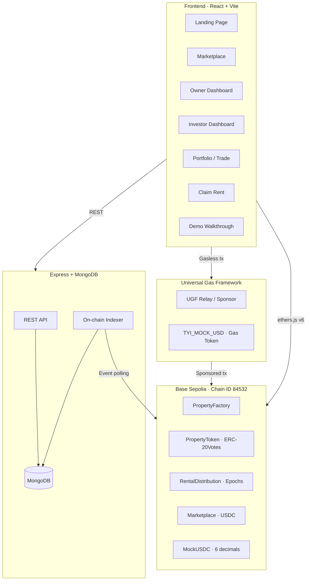
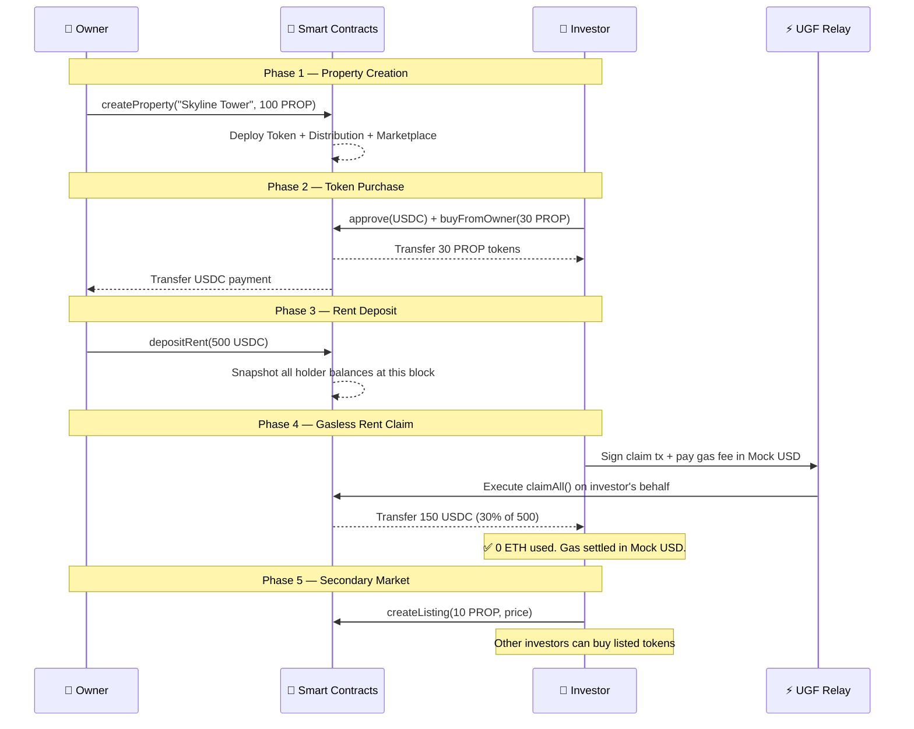
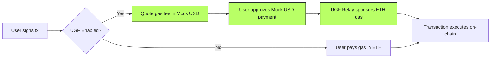
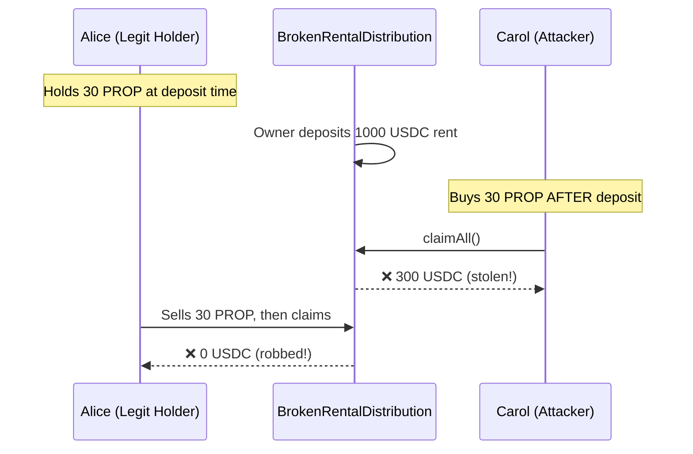

<](https://real-chain-git-main-ayushs-projects-f90c82c1.vercel.app)
[](https://sepolia.basescan.org)
[](LICENSE)

**Buy fractional property tokens · Earn USDC rent every epoch · Claim with zero ETH**

Gas is paid in Mock USD via the **Universal Gas Framework (UGF)** — no native ETH required.

</div>

---

## 🎯 The Problem

Traditional real estate requires **full property purchase**, is **illiquid** (can't sell a fraction), and rent collection is **manual and opaque**. Blockchain tokenization solves these — but introduces a **new barrier**: every transaction requires ETH for gas, shutting out users who only hold stablecoins.

**RealChain eliminates both barriers** — fractional ownership AND gasless transactions.

---

## 🏗️ Architecture



---

## 🔄 How It Works

### The Complete Lifecycle



### Role-Based Flow

```
┌─────────────────────────────────────────────────────────────────────┐
│                         RealChain Platform                         │
├──────────────────────────────┬──────────────────────────────────────┤
│        🏠 OWNER              │           💰 INVESTOR               │
├──────────────────────────────┼──────────────────────────────────────┤
│  • Create properties         │  • Browse marketplace               │
│  • Mint test USDC            │  • Buy fractional tokens            │
│  • Deposit rent (USDC)       │  • View pending rent                │
│  • Manage token supply       │  • Claim rent (gasless via UGF) ⚡  │
│  • Approve marketplace       │  • List tokens for resale           │
│                              │  • View P&L analytics               │
└──────────────────────────────┴──────────────────────────────────────┘
```

---

## ⚡ Universal Gas Framework (UGF)

The **key innovation** — every on-chain transaction can be executed without holding ETH.



| Without UGF | With UGF |
|---|---|
| ❌ User needs ETH for every tx | ✅ User pays in Mock USD |
| ❌ New users stuck at "buy ETH" step | ✅ Onboard with stablecoins only |
| ❌ Gas price volatility | ✅ Predictable fee in USD terms |

---

## 📦 Smart Contracts

| Contract | Purpose | Key Feature |
|---|---|---|
| `MockUSDC` | Mintable 6-decimal stablecoin | Testnet faucet-friendly |
| `PropertyToken` | ERC-20Votes — 100 PROP = 100% ownership | Auto-delegates for balance snapshots |
| `PropertyFactory` | Deploys Token + Distribution + Marketplace per property | On-chain registry with V1/V2 mode |
| `RentalDistribution` | Epoch-based pull dividends | **Snapshot-safe** — uses historical balance |
| `RentalDistributionV2` | Cumulative-index model | **O(1) claims** regardless of epoch count |
| `Marketplace` | USDC fixed-price primary + secondary market | Peer-to-peer token trading |
| `BrokenRentalDistribution` | Research baseline | Demonstrates snapshot timing vulnerability |

### Deployed Addresses (Base Sepolia)

| Contract | Address |
|---|---|
| MockUSDC | `0xc90610277191F7Dbe7Ddf18319Bd28D3aAAe9a38` |
| PropertyFactory | `0xa8bb0D4923C1aBB9294cBc115c6FF81B2DaC0168` |

---

## 🖥️ Tech Stack

| Layer | Technology |
|---|---|
| **Frontend** | React 18, Vite, ethers.js v6 |
| **Smart Contracts** | Solidity 0.8, OpenZeppelin, Hardhat |
| **Backend** | Express.js, MongoDB, Pino logging |
| **Network** | Base Sepolia (L2, Chain ID: 84532) |
| **Gasless** | Universal Gas Framework (UGF) |
| **Deployment** | Vercel (frontend), MongoDB Atlas (database) |
| **Design** | Space Grotesk + JetBrains Mono, CSS design system |

---

## 🚀 Quick Start

### Prerequisites

- Node.js ≥ 18
- MetaMask browser extension
- MongoDB (for backend features)

### 1. Install

```bash
git clone https://github.com/AyushX1602/Real-Chain.git
cd Real-Chain
npm install
cd frontend && npm install && cd ..
cd backend && npm install && cd ..
```

### 2. Configure

```bash
cp .env.example .env
# Edit .env with your keys:
#   PRIVATE_KEY=<deployer wallet>
#   MONGODB_URI=<your connection string>
```

### 3. Run Locally

```bash
# Terminal 1 — Hardhat node
npx hardhat node

# Terminal 2 — Deploy contracts
npx hardhat run scripts/deploy.js --network localhost

# Terminal 3 — Backend
cd backend && npm run dev

# Terminal 4 — Frontend
cd frontend && npm run dev
```

Open [http://localhost:5173](http://localhost:5173)

### 4. Deploy to Base Sepolia

```bash
npx hardhat run scripts/deploy.js --network baseSepolia
```

---

## 🧪 Testing

```bash
# Run all 31 tests
npx hardhat test
```

| Test Suite | Tests | What It Covers |
|---|---|---|
| `RealEstatePlatform.test.js` | 17 | Core USDC flow + snapshot correctness |
| `SnapshotAttack.test.js` | 5 | Security: attack demo + defence proof |
| `GasBenchmark.test.js` | 3 | Gas cost tables for research |
| `DistributionV2.test.js` | 3 | V2 security, fairness, accounting |
| `FactoryDistributionMode.test.js` | 2 | V1 default + V2 mode switch |
| `V1VsV2Benchmark.test.js` | 1 | Side-by-side gas comparison |

---

## 🔐 Security: Snapshot Timing Attack

The `BrokenRentalDistribution` contract uses **live** token balance — vulnerable to:



**RealChain fixes this** with `ERC20Votes.getPastVotes(user, snapshotBlock)` — dividends are calculated from the **historical balance at deposit time**, not the current balance.

| Actor | Broken (Vulnerable) | Fixed (RealChain) |
|---|---|---|
| Alice (held 30 PROP at deposit) | **0 USDC** ← robbed | 300 USDC ✅ |
| Carol (bought AFTER deposit) | **300 USDC** ← stolen | 0 USDC ✅ |

---

## 📊 Gas Benchmarks

### V1 — Epoch-based `claimAll()`

| Epochs | Gas Used | Est. Cost (20 gwei, ETH=$2000) |
|---|---|---|
| 1 | 85,503 | $3.42 |
| 6 | 243,483 | $9.74 |
| 12 | 433,060 | $17.32 |
| 24 | 812,216 | $32.49 |
| 48 | 1,570,535 | $62.82 |

### V2 — Cumulative-index `claim()`

| Operation | Gas | Note |
|---|---|---|
| Claim (any epoch count) | ~137,616 | **O(1)** — constant cost |
| Extra deposit overhead | +30,546 | vs V1 per deposit |
| Extra transfer overhead | +47,607 | Hook cost per transfer |

### When to Use V2

```
Choose V2 if accumulated epochs between claims ≥ 3
```

V1 is better for frequent traders + frequent claimers. V2 is better for long-term holders.

---

## 📁 Project Structure

```
RealChain/
├── contracts/                    # Solidity smart contracts
│   ├── MockUSDC.sol              # Test stablecoin (6 decimals)
│   ├── PropertyToken.sol         # ERC-20Votes — fractional ownership
│   ├── PropertyFactory.sol       # Registry + deployer
│   ├── RentalDistribution.sol    # Snapshot-safe epoch dividends
│   ├── RentalDistributionV2.sol  # O(1) cumulative-index claims
│   ├── Marketplace.sol           # Primary + secondary USDC market
│   └── BrokenRentalDistribution.sol  # [Research] Vulnerable baseline
├── scripts/
│   ├── deploy.js                 # Contract deployment
│   ├── seedDemo.js               # Seed demo data for testing
│   └── simulate.js               # Full lifecycle simulation
├── test/                         # 31 tests: security, gas, correctness
├── frontend/                     # React + Vite SPA
│   └── src/
│       ├── config/contracts.js   # Network config + ABIs
│       ├── context/              # Web3, UGF, Auth, Theme providers
│       ├── pages/                # All route pages
│       └── components/           # Reusable UI components
├── backend/                      # Express + MongoDB
│   ├── routes/                   # Auth, properties, transactions, faucet
│   ├── jobs/indexer.js           # On-chain event indexer
│   └── server.js                 # Entry point
├── hardhat.config.js             # Network + compiler config
├── DOCUMENTATION.md              # Detailed technical docs
└── PROJECT_EXPLAINED.txt         # Narrative guide for evaluators
```

---

## 🎓 Research Context

This platform was built as a prototype for academic research on:

1. **Smart contract security** — demonstrating and fixing the snapshot timing attack
2. **Gas scalability** — benchmarking epoch-based vs cumulative-index dividend models
3. **Gasless UX** — proving that DeFi can work without requiring native tokens

### Key Contribution

> A working implementation showing that tokenized real estate with gasless claim mechanics
> is viable on EVM L2 chains, with formal gas benchmarks comparing two distribution architectures.

---

## 👥 Built By

**Team Spirit** — Builders passionate about making real estate investment accessible through blockchain technology.

---

## 📜 License

Apache 2.0 — see [LICENSE](LICENSE) for details.

Design attribution: portions adapted from [Positivus Landing Page](https://www.figma.com/community/file/1230604708032389430) by Olga (CC BY 4.0) — see [NOTICE](NOTICE).
]]>
