# RealChain v2 — Hackathon Implementation Plan

## Dependency Graph

```mermaid
graph TD
    A["1A: baseSepolia in hardhat.config.js"] --> B["1B: Deploy contracts to Base Sepolia"]
    B --> C["1C: Update contracts.js with addresses"]
    C --> D["1D: Update Web3Context for Base Sepolia"]
    
    E["2A: OwnerDashboard.jsx"] --> G["2C: Update App.jsx routing + Navbar"]
    F["2B: InvestorDashboard.jsx"] --> G
    
    H["3A: Install UGF SDK"] --> I["3B: Build UGFContext.jsx"]
    I --> J["3C: Wrap claimAll in InvestorDashboard"]
    J --> K["3D: Gas-in-USDC UI indicators"]
    
    D --> J
    F --> J
    
    G --> L["4A: End-to-end test"]
    K --> L
    L --> M["4B: Record 60s demo"]

    style A fill:#1e3a5f
    style B fill:#1e3a5f
    style C fill:#1e3a5f
    style D fill:#1e3a5f
    style E fill:#2d4a2d
    style F fill:#2d4a2d
    style G fill:#2d4a2d
    style H fill:#5a2d5a
    style I fill:#5a2d5a
    style J fill:#5a2d5a
    style K fill:#5a2d5a
    style L fill:#4a3a1a
    style M fill:#4a3a1a
```



> [!IMPORTANT]
> **Blue = Infra (Person A)** | **Green = Dashboards (Person B & C)** | **Purple = UGF (Person D)** | **Gold = Everyone**

---

## Team Split (3-4 People)

| Person | Role | Works on | Can start immediately? |
|--------|------|----------|----------------------|
| **A — Infra Lead** | Network + Deploy | Phase 1 (all), deploy script fixes, demo state setup | ✅ Yes |
| **B — Owner UI** | OwnerDashboard | Phase 2A: OwnerDashboard.jsx | ✅ Yes (uses existing Web3Context) |
| **C — Investor UI** | InvestorDashboard | Phase 2B: InvestorDashboard.jsx | ✅ Yes (uses existing Web3Context) |
| **D — UGF Integrator** | UGF SDK + Context | Phase 3 (all) | ✅ Yes (SDK install + context skeleton) |

> If 3 people: merge B+C (one person builds both dashboards). If 4 people: all streams run fully parallel.

---

## Phase 1 — Infrastructure (Person A, ~2 hours)

### 1A. Add Base Sepolia network to hardhat.config.js

#### [MODIFY] [hardhat.config.js](file:///d:/codes/BlockChain/Real_estate_tokenization/hardhat.config.js)

Add after the `localhost` block:

```js
baseSepolia: {
  url: process.env.BASE_SEPOLIA_RPC_URL || "https://sepolia.base.org",
  accounts: process.env.PRIVATE_KEY ? [`0x${process.env.PRIVATE_KEY}`] : [],
  chainId: 84532,
},
```

Add to `.env.example` and `.env`:
```
BASE_SEPOLIA_RPC_URL=https://sepolia.base.org
```

**Depends on:** Nothing
**Blocks:** 1B

---

### 1B. Get testnet funds + Deploy to Base Sepolia

1. Get Base Sepolia ETH: https://www.alchemy.com/faucets/base-sepolia
2. Get TYI_MOCK_USD: https://universalgasframework.com/faucets
3. Set `PRIVATE_KEY` in `.env` to a funded wallet
4. Run: `npx hardhat run scripts/deploy.js --network baseSepolia`
5. Save the output addresses

**Depends on:** 1A
**Blocks:** 1C

---

### 1C. Update frontend network config

#### [MODIFY] [contracts.js](file:///d:/codes/BlockChain/Real_estate_tokenization/frontend/src/config/contracts.js)

```js
// Change these:
export const NETWORK_CHAIN_ID = 84532;
export const BASE_SEPOLIA_RPC_URL = "https://sepolia.base.org";

export const CONTRACT_ADDRESSES = {
  mockUsdc:        "<DEPLOYED_MOCK_USDC_ADDRESS>",
  propertyFactory: "<DEPLOYED_FACTORY_ADDRESS>",
};
```

**Depends on:** 1B
**Blocks:** 1D

---

### 1D. Update Web3Context for Base Sepolia

#### [MODIFY] [Web3Context.jsx](file:///d:/codes/BlockChain/Real_estate_tokenization/frontend/src/context/Web3Context.jsx)

- Change `getReadProvider()` to use Base Sepolia RPC instead of localhost
- Add Base Sepolia to `getExpectedNetworkConfig()`:
```js
if (NETWORK_CHAIN_ID === 84532) {
  return {
    chainIdHex: "0x14a34",
    params: {
      chainId: "0x14a34",
      chainName: "Base Sepolia",
      nativeCurrency: { name: "Ether", symbol: "ETH", decimals: 18 },
      rpcUrls: ["https://sepolia.base.org"],
      blockExplorerUrls: ["https://sepolia.basescan.org"],
    },
  };
}
```

**Depends on:** 1C
**Blocks:** 3C (UGF wrapping needs working Base Sepolia connection)

---

### 1E. Fix deploy script for clean demo state

#### [MODIFY] [deploy.js](file:///d:/codes/BlockChain/Real_estate_tokenization/scripts/deploy.js)

Add after property creation:
1. Auto-approve marketplace to spend owner's tokens (fixes primary buy bug)
2. Mint MockUSDC to 2-3 test investor wallets
3. Simulate: investor buys tokens, owner deposits rent → creates pending dividends
4. Document the investor wallet that has pending dividends + zero ETH

**Depends on:** 1B
**Blocks:** 4A (demo needs pre-configured state)

---

### 1F. Add convenience scripts to package.json

#### [MODIFY] [package.json](file:///d:/codes/BlockChain/Real_estate_tokenization/package.json)

```json
"scripts": {
  "compile": "hardhat compile",
  "test": "hardhat test",
  "node": "hardhat node",
  "deploy:local": "hardhat run scripts/deploy.js --network localhost",
  "deploy:base": "hardhat run scripts/deploy.js --network baseSepolia",
  "dev": "cd frontend && npm run dev"
}
```

**Depends on:** Nothing
**Blocks:** Nothing (quality of life)

---

## Phase 2 — Role-Specific Dashboards (Person B + C, ~3-4 hours)

> [!NOTE]
> B and C can work **fully in parallel** from minute 0. They only need the existing `Web3Context.jsx` and `contracts.js` (already working on localhost). Their pages will work on Base Sepolia automatically once Person A finishes Phase 1.

### 2A. OwnerDashboard.jsx (Person B)

#### [NEW] [OwnerDashboard.jsx](file:///d:/codes/BlockChain/Real_estate_tokenization/frontend/src/pages/OwnerDashboard.jsx)

**What it shows:**
- Properties owned by connected wallet (filter from factory by `owner === account`)
- For each property: remaining token supply, total rent deposited, epoch history
- **Deposit Rental Income** form (extracted from current Dividends.jsx lines 211-226)
- **Create New Property** button (calls `factory.createProperty()`)

**Data sources (all exist already):**
- `getReadFactory()` → `factory.properties(i)` → filter by owner
- `getReadPropertyContracts()` → `rental.epochCount()`, `token.totalSupply()`
- `getPropertyContracts()` → `rental.depositRental()` for write operations
- `getUsdc()` → `usdc.approve()` before deposit

**Copy/adapt from:**
- Deposit form: [Dividends.jsx lines 143-226](file:///d:/codes/BlockChain/Real_estate_tokenization/frontend/src/pages/Dividends.jsx#L143-L226)
- Property loading pattern: [Home.jsx](file:///d:/codes/BlockChain/Real_estate_tokenization/frontend/src/pages/Home.jsx)

**Depends on:** Nothing (uses existing Web3Context)
**Blocks:** 2C (routing update)

---

### 2B. InvestorDashboard.jsx (Person C)

#### [NEW] [InvestorDashboard.jsx](file:///d:/codes/BlockChain/Real_estate_tokenization/frontend/src/pages/InvestorDashboard.jsx)

**What it shows:**
- Portfolio summary: properties where `token.balanceOf(account) > 0`
- Total pending dividends across all properties (big number, center stage)
- **⚡ Claim All Dividends** button — THIS IS THE HACKATHON CENTERPIECE
- Per-property breakdown: tokens held, pending amount, epoch history
- Secondary market listings created by this investor
- Link to browse all properties

**Data sources (all exist already):**
- Portfolio data: copy pattern from [Portfolio.jsx](file:///d:/codes/BlockChain/Real_estate_tokenization/frontend/src/pages/Portfolio.jsx)
- Dividend data: copy pattern from [Dividends.jsx lines 13-57](file:///d:/codes/BlockChain/Real_estate_tokenization/frontend/src/pages/Dividends.jsx#L13-L57)
- Claim logic: copy from [Dividends.jsx lines 131-141](file:///d:/codes/BlockChain/Real_estate_tokenization/frontend/src/pages/Dividends.jsx#L131-L141)

**Important:** Build the claim button as a normal `rental.claimAll()` call first. Person D will swap it with UGF later.

**Depends on:** Nothing (uses existing Web3Context)
**Blocks:** 2C (routing update), 3C (UGF wraps this button)

---

### 2C. Update App.jsx routing + Navbar (Person B or C, after dashboards exist)

#### [MODIFY] [App.jsx](file:///d:/codes/BlockChain/Real_estate_tokenization/frontend/src/App.jsx)

**Routing changes:**
```jsx
import OwnerDashboard from "./pages/OwnerDashboard";
import InvestorDashboard from "./pages/InvestorDashboard";

// Add new routes:
<Route path="/owner" element={<OwnerDashboard />} />
<Route path="/investor" element={<InvestorDashboard />} />
```

**Navbar changes:**
- If `roleHint === "Owner"` → show "Dashboard" linking to `/owner`
- If `roleHint === "Investor"` → show "Dashboard" linking to `/investor`
- Keep Properties, Portfolio, Dividends links for backward compatibility
- Remove "Switch Account" button (or move to settings)

**Depends on:** 2A and 2B (pages must exist to route to)
**Blocks:** 4A

---

## Phase 3 — UGF Integration (Person D, ~3-4 hours)

### 3A. Install UGF SDK

```powershell
cd frontend
npm install @tychilabs/react-ugf
```

**Depends on:** Nothing
**Blocks:** 3B

---

### 3B. Build UGFContext.jsx

#### [NEW] [UGFContext.jsx](file:///d:/codes/BlockChain/Real_estate_tokenization/frontend/src/context/UGFContext.jsx)

```jsx
import { UGFProvider, useUGFModal } from "@tychilabs/react-ugf";

// Wrapper context that provides:
// - openUGF() from the SDK
// - Helper: ugfExecute(signer, contractAddress, encodedData) 
//   that calls openUGF with destChainId: "84532"
// - State: isUGFEnabled (toggle for judges to compare with/without)
```

**Also modify [main.jsx](file:///d:/codes/BlockChain/Real_estate_tokenization/frontend/src/main.jsx):**
```jsx
import { UGFProvider } from "@tychilabs/react-ugf";

// Wrap the app:
<UGFProvider>
  <Web3Provider>
    <BrowserRouter>
      <App />
    </BrowserRouter>
  </Web3Provider>
</UGFProvider>
```

**Depends on:** 3A
**Blocks:** 3C

---

### 3C. Wrap claimAll() with UGF in InvestorDashboard

#### [MODIFY] InvestorDashboard.jsx (built by Person C)

Replace the direct `rental.claimAll()` call with:

```jsx
import { useUGFModal } from "@tychilabs/react-ugf";

const { openUGF } = useUGFModal();

async function handleClaimAllUGF() {
  const { rental } = getRw();
  const iface = new ethers.Interface(RENTAL_DISTRIBUTION_ABI);
  const data = iface.encodeFunctionData("claimAll", []);
  
  await openUGF({
    signer,
    tx: {
      to: prop.rentalDistribution,
      data: data,
      value: 0n,
    },
    destChainId: "84532",
  });
}
```

**Depends on:** 3B (UGFContext), 2B (InvestorDashboard), 1D (Base Sepolia connection)
**Blocks:** 3D

---

### 3D. Gas-in-USDC UI indicators

Add to every UGF-powered button:

```jsx
<button className="btn btn-primary btn-full" onClick={handleClaimAllUGF}>
  ⚡ Claim All Dividends — {fmtUsdc(pending)}
</button>
<span className="ugf-badge">💎 Gas paid in Mock USD — no ETH needed</span>
```

Add CSS for `.ugf-badge` in [index.css](file:///d:/codes/BlockChain/Real_estate_tokenization/frontend/src/index.css).

Optional stretch: add a "Gas-free Mode" toggle so judges can compare UGF vs normal flow.

**Depends on:** 3C
**Blocks:** 4A

---

## Phase 4 — Polish & Demo (Everyone, ~1-2 hours)

### 4A. End-to-end test

**Test script (everyone runs this):**
1. Open app on Base Sepolia
2. Connect wallet with investor account (has tokens, pending dividends, zero ETH)
3. Verify InvestorDashboard shows pending dividends
4. Click "Claim All Dividends"
5. UGF modal appears → shows gas cost in TYI_MOCK_USD
6. Confirm → transaction succeeds
7. USDC balance increases, zero ETH spent

**Depends on:** All phases complete
**Blocks:** 4B

### 4B. Record 60-second demo

The demo for judges (in this exact order):
1. Show MetaMask: some TYI_MOCK_USD, **0 ETH**
2. Open app → auto-detects "Investor" role
3. InvestorDashboard: pending dividends = $X.XX
4. Click "Claim All" → UGF popup: "Gas: $0.04 Mock USD"
5. Confirm → tx succeeds via UGF relay
6. Show MetaMask: dividends arrived, still 0 ETH
7. Done in 60 seconds

---

## Timeline (Parallel Execution)

```
Hour 0─1       Hour 1─2       Hour 2─4       Hour 4─6       Hour 6─7
─────────────────────────────────────────────────────────────────────
Person A: [1A: Config]──[1B: Deploy]──[1C+1D: Frontend config]──[1E: Demo state]──[4A: Test]
Person B: [2A: OwnerDashboard ──────────────────]──[2C: Routing]──[4A: Test]
Person C: [2B: InvestorDashboard ───────────────]──[2C: Help]────[4A: Test]
Person D: [3A: Install]──[3B: UGFContext]──[wait for 2B+1D]──[3C: Wrap claim]──[3D: UI]──[4A]
                                                              ▲
                                                    MERGE POINT: Person D needs
                                                    InvestorDashboard (from C)
                                                    + Base Sepolia (from A)
```

> [!IMPORTANT]
> **The critical merge point is Hour 4**: Person D cannot wire UGF into the claim button until Person C's InvestorDashboard exists AND Person A's Base Sepolia deployment is live. Plan your merge here.

---

## What Each Person Delivers

| Person | Deliverable | Files Created/Modified | Definition of Done |
|--------|------------|----------------------|-------------------|
| **A** | Working Base Sepolia deployment | `hardhat.config.js`, `.env`, `contracts.js`, `Web3Context.jsx`, `deploy.js`, `package.json` | Contracts deployed, frontend connects to Base Sepolia, demo state seeded |
| **B** | Owner Dashboard | `OwnerDashboard.jsx`, `App.jsx` (routing) | Owner can deposit rent, see their properties, see epoch history |
| **C** | Investor Dashboard | `InvestorDashboard.jsx`, `App.jsx` (routing) | Investor can see portfolio, pending dividends, and claim (normal flow first) |
| **D** | UGF gasless claims | `UGFContext.jsx`, `main.jsx`, `InvestorDashboard.jsx` (modify), `index.css` | Claim works with 0 ETH, shows "gas paid in Mock USD" |

---

## Open Questions

> [!WARNING]
> **Resolve these before starting Phase 1:**
> 1. **Who has the deployer wallet?** — One person needs to create/fund a MetaMask wallet with Base Sepolia ETH and share the address (NOT the private key) so everyone can configure
> 2. **Do you want to keep localhost dev mode?** — I recommend a config toggle: `NETWORK_MODE=local|baseSepolia` so devs can still test locally
> 3. **3 or 4 people?** — If 3, Person B builds both dashboards. If 4, split as shown above
> 4. **UGF API key needed?** — Check if `@tychilabs/react-ugf` requires an API key or if testnet is open

## Verification Plan

### Automated Tests
- `npx hardhat test` — all 31 tests must still pass (contracts unchanged)
- `npx hardhat run scripts/deploy.js --network baseSepolia` — deployment succeeds

### Manual Verification
- Frontend connects to Base Sepolia via MetaMask
- Owner sees OwnerDashboard, Investor sees InvestorDashboard
- Investor with 0 ETH can claim dividends via UGF
- UGF modal shows gas cost in TYI_MOCK_USD
