# RealChain v2 — Hackathon Implementation Plan

> **Hackathon**: UGF (Universal Gas Framework) Hackathon — Track 3 (Wallet & Agents / "reward claim" use case).
> **North star**: an investor with **0 ETH** opens the app on Base Sepolia, clicks one button, and receives their USDC rent — gas paid in Mock USD by UGF. The user never touches ETH.
> **Authoritative problem statement**: `../hackathon_ps.pdf`. The full UX brief is `HACKATHON_PLAN.txt`.

---

## Win Strategy: Tiered Build

To go from "decent submission" to "top-tier", the build is split into three tiers. Tiers MUST be shipped strictly in order. Do **not** start a higher tier until the lower tier is demo-ready end-to-end.

| Tier | Goal | Status |
|------|------|--------|
| **Tier 1 — Mandatory** | Cover the spec: zero-ETH `claimAll()` on Base Sepolia with role-based UX | Planned in Phases 1–4 below |
| **Tier 2 — Differentiators** | Things most teams will skip; turns a pass into a win | Planned in Phase 5 below |
| **Tier 3 — Stretch** | Only if Tier 1 + 2 are already shipped and stable | Planned in Phase 6 below |

### What We're Deliberately Cutting From The Hackathon Submission

- The V1/V2 distribution comparison and snapshot-attack research findings stay **in the repo** (for the academic paper) but are **not surfaced to judges**. The hackathon README must be ruthlessly about "zero-ETH rent claims with UGF".
- The Express + MongoDB backend has no judge-visible job today. Either give it one (Tier 2 activity feed, Phase 5C) or hide it from the submission.

### Risks To Resolve Before Phase 1

1. **Two "Mock USD" tokens are on the table**:
   - Our `MockUSDC` (our contract, ERC-20 with 6 decimals) — used as **rent settlement currency**.
   - UGF's `TYI_MOCK_USD` — used by UGF as the **gas settlement token** on Base Sepolia.
   - Decision: keep our `MockUSDC` for rent (all contracts already speak it). UGF only touches `TYI_MOCK_USD` for gas. UI copy MUST distinguish them: "Receive USDC" vs "Pay gas in Mock USD".
2. **Deployer wallet must hold Base Sepolia ETH** (faucet) before the demo day. Do this first.
3. **UGF SDK API surface is moving** — verify against live docs before integrating. `HACKATHON_PLAN.txt` is internal context, not API truth.

---

## Dependency Graph (Tiers 1–3)

```mermaid
graph TD
    subgraph "Tier 1 — Mandatory"
      A["1A: baseSepolia in hardhat.config.js"] --> B["1B: Deploy contracts to Base Sepolia"]
      B --> C["1C: Update contracts.js with addresses"]
      C --> D["1D: Update Web3Context for Base Sepolia"]
      B --> E1["1E: Demo-state seeding script"]

      OwnerDash["2A: OwnerDashboard.jsx"] --> Routing["2C: Update App.jsx routing + Navbar"]
      InvDash["2B: InvestorDashboard.jsx"] --> Routing

      H["3A: Install UGF SDK"] --> I["3B: Build UGFContext.jsx"]
      I --> J["3C: Wrap claimAll in InvestorDashboard"]
      J --> K["3D: Gas-in-USDC UI indicators"]

      D --> J
      InvDash --> J

      Routing --> L["4A: End-to-end test"]
      K --> L
      L --> M["4B: Record 60s demo"]
    end

    subgraph "Tier 2 — Differentiators"
      L --> T2A["5A: Wrap deposit/buy/list with UGF"]
      L --> T2B["5B: UGF on/off toggle (proves the thesis)"]
      L --> T2C["5C: Activity feed (gives backend a job)"]
      L --> T2D["5D: Side-by-side cost banner"]
      L --> T2E["5E: Rename Dividends → Claim Rent"]
      L --> T2F["5F: Embedded faucet helper"]
      L --> T2G["5G: Brand + landing screen"]
    end

    subgraph "Tier 3 — Stretch"
      T2A --> T3A["6A: Embedded wallet (Privy/Web3Auth)"]
      T2A --> T3B["6B: Soulbound NFT receipt per claim"]
      T2G --> T3C["6C: Pitch video"]
      T2G --> T3D["6D: Live demo URL"]
    end

    style A fill:#1e3a5f
    style B fill:#1e3a5f
    style C fill:#1e3a5f
    style D fill:#1e3a5f
    style E1 fill:#1e3a5f
    style OwnerDash fill:#2d4a2d
    style InvDash fill:#2d4a2d
    style Routing fill:#2d4a2d
    style H fill:#5a2d5a
    style I fill:#5a2d5a
    style J fill:#5a2d5a
    style K fill:#5a2d5a
    style L fill:#4a3a1a
    style M fill:#4a3a1a
    style T2A fill:#3a5a1a
    style T2B fill:#3a5a1a
    style T2C fill:#3a5a1a
    style T2D fill:#3a5a1a
    style T2E fill:#3a5a1a
    style T2F fill:#3a5a1a
    style T2G fill:#3a5a1a
    style T3A fill:#5a4a1a
    style T3B fill:#5a4a1a
    style T3C fill:#5a4a1a
    style T3D fill:#5a4a1a
```



> **Legend**: Blue = Infra • Green (dark) = Dashboards • Purple = UGF • Gold = Demo • Green (light) = Differentiators • Tan = Stretch.

---

## Team Split (3–4 People)

| Person | Role | Tier 1 | Tier 2 | Tier 3 |
|--------|------|--------|--------|--------|
| **A — Infra Lead** | Network + Deploy | Phase 1 (1A–1F), Phase 4 | 5C (activity feed wiring), 5F (faucet helper) | 6D (live demo URL) |
| **B — Owner UI** | OwnerDashboard | Phase 2A | 5A.2 (wrap depositRental), 5E (rename) | 6B partial (NFT receipt UI) |
| **C — Investor UI** | InvestorDashboard | Phase 2B, 2C | 5A.3/5A.4 (wrap buy flows), 5D (cost banner) | 6A (embedded wallet) |
| **D — UGF Integrator** | UGF SDK + Context | Phase 3 (3A–3D) | 5A.1 (UGF generic helper), 5B (toggle) | 6B (NFT receipt contract) |
| **All** | Polish | 4A, 4B | 5G (brand pass) | 6C (pitch video) |

> If 3 people: merge B+C (one person owns both dashboards).

---

# Tier 1 — Mandatory (Phases 1–4)

This is the spec floor. If Tier 1 is not done, nothing else matters.

## Phase 1 — Infrastructure (Person A, ~2 hours)

### 1A. Add Base Sepolia network to hardhat.config.js

#### [MODIFY] [hardhat.config.js](file:///d:/codes/BlockChain/Real_estate_tokenization/hardhat.config.js)

Add after the `localhost` block:

```js
baseSepolia: {
  url: process.env.BASE_SEPOLIA_RPC_URL || "https://sepolia.base.org",
  accounts: process.env.PRIVATE_KEY ? [`0x${process.env.PRIVATE_KEY}`] : [],
  chainId: 84532,
},
```

Add to `.env.example` and `.env`:
```
BASE_SEPOLIA_RPC_URL=https://sepolia.base.org
```

**Depends on:** Nothing
**Blocks:** 1B

> **Status note (2026-05-17 evening)**: `baseSepolia` is already wired into `hardhat.config.js`. Verify before re-doing.

---

### 1B. Get testnet funds + Deploy to Base Sepolia

1. Get Base Sepolia ETH: https://www.alchemy.com/faucets/base-sepolia
2. Get TYI_MOCK_USD: https://universalgasframework.com/faucets
3. Set `PRIVATE_KEY` in `.env` to a funded wallet
4. Run: `npx hardhat run scripts/deploy.js --network baseSepolia`
5. Save the output addresses to `deployed-addresses.json`

**Depends on:** 1A
**Blocks:** 1C, 1E, all of Phase 3+ on testnet

---

### 1C. Update frontend network config

#### [MODIFY] [contracts.js](file:///d:/codes/BlockChain/Real_estate_tokenization/frontend/src/config/contracts.js)

```js
export const NETWORK_CHAIN_ID = 84532;
export const BASE_SEPOLIA_RPC_URL = "https://sepolia.base.org";

export const CONTRACT_ADDRESSES = {
  mockUsdc:        "<DEPLOYED_MOCK_USDC_ADDRESS>",
  propertyFactory: "<DEPLOYED_FACTORY_ADDRESS>",
};
```

**Depends on:** 1B
**Blocks:** 1D

---

### 1D. Update Web3Context for Base Sepolia

#### [MODIFY] [Web3Context.jsx](file:///d:/codes/BlockChain/Real_estate_tokenization/frontend/src/context/Web3Context.jsx)

- Update `getReadProvider()` to use Base Sepolia RPC.
- Add Base Sepolia to `getExpectedNetworkConfig()`:

```js
if (NETWORK_CHAIN_ID === 84532) {
  return {
    chainIdHex: "0x14a34",
    params: {
      chainId: "0x14a34",
      chainName: "Base Sepolia",
      nativeCurrency: { name: "Ether", symbol: "ETH", decimals: 18 },
      rpcUrls: ["https://sepolia.base.org"],
      blockExplorerUrls: ["https://sepolia.basescan.org"],
    },
  };
}
```

**Depends on:** 1C
**Blocks:** 3C

---

### 1E. Deterministic demo-state seeding

The 60-second demo only works if the demo wallet lands with **tokens, pending rent, and zero ETH**. Manual setup the morning of pitch day is a known failure mode.

#### [MODIFY] [scripts/deploy.js](file:///d:/codes/BlockChain/Real_estate_tokenization/scripts/deploy.js) AND/OR [NEW] [scripts/seedDemo.js](file:///d:/codes/BlockChain/Real_estate_tokenization/scripts/seedDemo.js)

The seeding script must:

1. Auto-approve the marketplace to spend the owner's PROP tokens (otherwise primary purchases revert).
2. Mint MockUSDC to 2–3 designated investor wallets.
3. Have one investor wallet buy a known number of PROP tokens.
4. Have the property owner deposit a known USDC rent amount → creates an unclaimed epoch.
5. **Empty the demo investor wallet of ETH** (or document a wallet that was funded only with USDC). This is the wallet judges will see.
6. Print a "Demo wallet" block at the end with: address, USDC balance, PROP balance, pending dividends, ETH balance (= 0).

**Depends on:** 1B
**Blocks:** 4A — the demo path itself

---

### 1F. Add convenience scripts to package.json

#### [MODIFY] [package.json](file:///d:/codes/BlockChain/Real_estate_tokenization/package.json)

```json
"scripts": {
  "compile": "hardhat compile",
  "test": "hardhat test",
  "node": "hardhat node",
  "deploy:local": "hardhat run scripts/deploy.js --network localhost",
  "deploy:base": "hardhat run scripts/deploy.js --network baseSepolia",
  "seed:base": "hardhat run scripts/seedDemo.js --network baseSepolia",
  "dev:frontend": "cd frontend && npm run dev",
  "dev:backend": "cd backend && npm run dev"
}
```

**Depends on:** Nothing.
**Blocks:** Nothing (quality-of-life).

> **Status note**: Most of these scripts already exist. Add only what is missing.

---

## Phase 2 — Role-Specific Dashboards (Persons B + C, ~3–4 hours)

> B and C work fully in parallel. They only need the existing `Web3Context.jsx`.

### 2A. OwnerDashboard.jsx (Person B)

#### [NEW] [OwnerDashboard.jsx](file:///d:/codes/BlockChain/Real_estate_tokenization/frontend/src/pages/OwnerDashboard.jsx)

**What it shows:**
- Properties owned by connected wallet (filter from factory by `owner === account`).
- For each property: remaining token supply, total rent deposited, epoch history.
- **Deposit Rental Income** form (extracted from current `Dividends.jsx` lines 211–226).
- **Create New Property** button (calls `factory.createProperty()`).

**Data sources:**
- `getReadFactory()` → `factory.properties(i)` → filter by owner.
- `getReadPropertyContracts()` → `rental.epochCount()`, `token.totalSupply()`.
- `getPropertyContracts()` → `rental.depositRental()`.
- `getUsdc()` → `usdc.approve()` before deposit.

**Copy from:** Deposit form in `Dividends.jsx` lines 143–226. Property loading pattern from `Home.jsx`.

**Depends on:** Nothing.
**Blocks:** 2C, 5A.2 (deposit goes gasless in Tier 2), 5E.

---

### 2B. InvestorDashboard.jsx (Person C)

#### [NEW] [InvestorDashboard.jsx](file:///d:/codes/BlockChain/Real_estate_tokenization/frontend/src/pages/InvestorDashboard.jsx)

**What it shows:**
- Portfolio summary: properties where `token.balanceOf(account) > 0`.
- Total pending dividends across all properties (big number, center stage).
- **⚡ Claim All Rent** button — the hackathon centerpiece.
- Per-property breakdown: tokens held, pending amount, epoch history.
- Secondary market listings created by this investor.
- Link to browse all properties.

**Data sources:**
- Portfolio data: copy pattern from `Portfolio.jsx`.
- Dividend data: copy pattern from `Dividends.jsx` lines 13–57.
- Claim logic: copy from `Dividends.jsx` lines 131–141.

**Important:** Build the claim button as a normal `rental.claimAll()` first. Person D swaps it with UGF in 3C.

**Depends on:** Nothing.
**Blocks:** 2C, 3C, 5A.3, 5A.4, 5D.

---

### 2C. Update App.jsx routing + Navbar

#### [MODIFY] [App.jsx](file:///d:/codes/BlockChain/Real_estate_tokenization/frontend/src/App.jsx)

**Routing:**
```jsx
import OwnerDashboard from "./pages/OwnerDashboard";
import InvestorDashboard from "./pages/InvestorDashboard";

<Route path="/owner" element={<OwnerDashboard />} />
<Route path="/investor" element={<InvestorDashboard />} />
```

**Navbar:**
- If `roleHint === "Owner"` → show "Dashboard" → `/owner`.
- If `roleHint === "Investor"` → show "Dashboard" → `/investor`.
- Keep Properties / Portfolio / Dividends links for backward compatibility.
- Remove "Switch Account" button (or move to settings).

**Depends on:** 2A and 2B.
**Blocks:** 4A.

---

## Phase 3 — UGF Integration (Person D, ~3–4 hours)

### 3A. Install UGF SDK

```powershell
cd frontend
npm install @tychilabs/react-ugf
```

**Depends on:** Nothing.
**Blocks:** 3B.

---

### 3B. Build UGFContext.jsx

#### [NEW] [UGFContext.jsx](file:///d:/codes/BlockChain/Real_estate_tokenization/frontend/src/context/UGFContext.jsx)

```jsx
import { UGFProvider, useUGFModal } from "@tychilabs/react-ugf";

// Wrapper context that exposes:
// - openUGF() from the SDK
// - ugfExecute(signer, contractAddress, encodedData, value=0n) → calls openUGF with destChainId "84532"
// - isUGFEnabled state (drives the Tier 2 toggle in 5B)
// - getQuote(signer, tx) helper for cost previews
```

**Also modify [main.jsx](file:///d:/codes/BlockChain/Real_estate_tokenization/frontend/src/main.jsx):**
```jsx
import { UGFProvider } from "@tychilabs/react-ugf";

<UGFProvider>
  <Web3Provider>
    <BrowserRouter><App /></BrowserRouter>
  </Web3Provider>
</UGFProvider>
```

**Depends on:** 3A.
**Blocks:** 3C, 5A, 5B.

---

### 3C. Wrap claimAll() with UGF in InvestorDashboard

#### [MODIFY] InvestorDashboard.jsx

Replace the direct `rental.claimAll()` call with:

```jsx
import { useUGFModal } from "@tychilabs/react-ugf";
const { openUGF } = useUGFModal();

async function handleClaimAllUGF(prop) {
  const iface = new ethers.Interface(RENTAL_DISTRIBUTION_ABI);
  const data = iface.encodeFunctionData("claimAll", []);
  await openUGF({
    signer,
    tx: { to: prop.rentalDistribution, data, value: 0n },
    destChainId: "84532",
  });
}
```

**Depends on:** 3B, 2B, 1D.
**Blocks:** 3D, 5A.

---

### 3D. Gas-in-USDC UI indicators

```jsx
<button className="btn btn-primary btn-full" onClick={handleClaimAllUGF}>
  ⚡ Claim All Rent — {fmtUsdc(pending)}
</button>
<span className="ugf-badge">💎 Gas paid in Mock USD — no ETH needed</span>
```

Add `.ugf-badge` styles to `frontend/src/index.css`.

**Depends on:** 3C.
**Blocks:** 4A.

---

## Phase 4 — Polish & Demo (Everyone, ~1–2 hours)

### 4A. End-to-end test

1. Open app on Base Sepolia.
2. Connect demo investor wallet (tokens, pending rent, **0 ETH**).
3. Verify InvestorDashboard shows pending dividends.
4. Click "Claim All Rent".
5. UGF modal shows gas cost in Mock USD.
6. Confirm → tx succeeds.
7. USDC balance increases, ETH balance still 0.

**Depends on:** All of Phase 1–3.
**Blocks:** 4B.

### 4B. Record 60-second demo

Use the script in `HACKATHON_PLAN.txt` → "WHAT THE DEMO SHOULD SHOW (FOR JUDGES)".

---

# Tier 2 — Differentiators (Phase 5)

These are the moves most teams will skip. Each one alone is small. Together they push the submission above the median.

> **Gate**: do NOT start Phase 5 until 4A passes end-to-end.

## Phase 5 — Differentiators

### 5A. Wrap all four state-changing flows with UGF

The `claimAll()` flow alone covers the spec, but the whole demo becomes zero-ETH if every state-changing call goes through UGF. This kills the "but you still need ETH for X" objection.

| Sub-task | Owner | What changes |
|----------|-------|--------------|
| **5A.1** Generic `ugfExecute(contractAddr, abi, fnName, args, value=0)` helper in UGFContext | D | One helper used by 3C, 5A.2, 5A.3, 5A.4 |
| **5A.2** UGF-wrap `depositRental()` in OwnerDashboard | B | Owner deposits rent gaslessly |
| **5A.3** UGF-wrap `buyFromOwner()` in Property page | C | Investor primary buy gaslessly |
| **5A.4** UGF-wrap `buyFromListing()` and `cancelListing()` | C | Secondary trades gaslessly |

**Note**: ERC-20 `approve()` calls before each purchase ALSO need UGF wrapping. Either pre-approve infinite during onboarding (cleaner UX) or wrap each `approve` individually.

**Depends on:** Phase 4A.
**Blocks:** 6A, 6B.

---

### 5B. UGF on/off toggle

A switch in the Navbar settings: `[UGF Mode  ON ◯ OFF]`.

- ON → all state-changing calls go through UGF.
- OFF → all state-changing calls go through normal MetaMask flow.

The 10-second judge demo:
1. Toggle OFF → click claim → MetaMask wants ETH → fails (wallet has 0 ETH).
2. Toggle ON → click claim → UGF popup → succeeds.

This **proves the thesis** in front of the judges' eyes.

#### [NEW] State in UGFContext: `isUGFEnabled` (default true)
#### [MODIFY] All UGF-wrapped buttons: branch on `isUGFEnabled`

**Depends on:** 5A.
**Blocks:** Nothing critical.

---

### 5C. Activity feed (gives the backend a job)

The Express backend already exposes `/api/transactions`. Surface it on the home page:

> *"0x5a2…f1 claimed $42.18 in rent — gasless via UGF — 14 seconds ago"*

#### [MODIFY] [backend/routes/transactions.js](file:///d:/codes/BlockChain/Real_estate_tokenization/backend/routes/transactions.js)
- Accept POST when a UGF claim succeeds (frontend logs after `openUGF` resolves).
- GET returns last 50, sorted by timestamp desc.

#### [MODIFY] frontend Home.jsx
- Add an `<ActivityFeed />` component that polls `/api/transactions` every 8s.
- Highlight UGF-paid claims with the gas badge.

#### [MODIFY] InvestorDashboard.jsx + OwnerDashboard.jsx
- After a successful UGF tx, POST `{ type, propertyAddress, account, usdcAmount, gasCostMockUsd, txHash }` to `/api/transactions`.

**Why this matters:** It (a) gives the backend a visible role and (b) makes the app feel alive during the demo.

**Depends on:** 5A (so there's something to log).
**Blocks:** Nothing.

---

### 5D. Side-by-side cost banner

On every UGF-powered button:

> ⚡ Claim All Rent — $48.32
>
> Without UGF: ~$3.50 ETH (you have 0)
> With UGF: ~$0.04 Mock USD ✓

This makes the value prop unmissable. Use UGF's quote API for the "with UGF" number; estimate ETH gas via `provider.estimateGas()` × current gas price for the "without UGF" number.

**Depends on:** 5A.
**Blocks:** Nothing.

---

### 5E. Rename "Dividends" → "Claim Rent"

"Dividends" reads as DeFi jargon; "Claim Rent" is universal and beginner-friendly (which is what the hackathon explicitly asks for).

Surfaces to rename:
- Navbar link
- Page title in `Dividends.jsx`
- All button labels
- README screenshots

Keep the route `/dividends` for backward compatibility, but the **visible** label is "Claim Rent" everywhere.

**Depends on:** Nothing.
**Blocks:** Nothing.

---

### 5F. Embedded faucet helper

A "Get Started" panel on the home page (visible when `usdcBalance === 0` or `propBalance === 0`):

- **Button 1**: "Get Mock USD for gas" → opens `https://universalgasframework.com/faucets` in a new tab.
- **Button 2**: "Mint USDC to my wallet" → calls `MockUSDC.mint(account, 1000_000_000)` from a deployer-funded helper. (Gate this behind a faucet endpoint or rate limit.)
- **Button 3**: "Drop me into demo investor wallet" → shows the seeded demo wallet's mnemonic for judges, in a copy-to-clipboard box.

This removes friction for judges who land cold.

**Depends on:** 1E (seeded demo wallet must exist).
**Blocks:** Nothing.

---

### 5G. Brand pass

"RealChain v2" is generic. Hackathon scoring is partly aesthetic.

- Pick a name + one-line tagline. Suggestion: **"RentBox — claim your rent, never touch ETH."**
- Add a real logo to the navbar (SVG, < 5 KB).
- One-screen marketing landing on `/` for non-connected users: hero + 3 feature pills + "Connect Wallet" CTA.
- Consistent color system (dark UI is fine — just commit to one accent color).

**Depends on:** Nothing.
**Blocks:** 6C, 6D.

---

# Tier 3 — Stretch (Phase 6)

> **Gate**: do NOT start Phase 6 until Phase 5A, 5B, 5C, 5D, 5E are all green. 5F and 5G can be in flight.

## Phase 6 — Stretch goals

### 6A. Embedded wallet (Privy or Web3Auth)

Email login → smart wallet → UGF gasless claim. This collapses the two friction points (no ETH **and** no MetaMask) into a single email-based onboarding.

This is the Tier 3 move that genuinely wins "beginner-friendly" scoring.

#### [INSTALL] `@privy-io/react-auth` (or equivalent)
#### [MODIFY] Web3Context to accept either a MetaMask signer OR a Privy embedded signer.

**Depends on:** 5A. **Blocks:** Nothing.

---

### 6B. Soulbound NFT receipt per claim

Every successful UGF claim mints a non-transferable ERC-721 to the investor. The token URI shows: amount, date, property name, "claimed gaslessly via UGF".

Hits the **Minting track** in addition to **Wallet/Agents**, which the hackathon explicitly invites.

#### [NEW] [contracts/ClaimReceipt.sol](file:///d:/codes/BlockChain/Real_estate_tokenization/contracts/ClaimReceipt.sol)
- ERC-721 with `_update` override to revert on transfer (soulbound).
- Mint authority = `RentalDistribution` (or a single relayer).

#### [MODIFY] RentalDistribution._claim → call ClaimReceipt.mint after USDC transfer.
#### [MODIFY] Investor dashboard → "Your Receipts" gallery.

> Trade-off: requires re-deploying contracts. Only do this if 5A is fully shipped and stable.

**Depends on:** 5A. **Blocks:** Nothing.

---

### 6C. 60-second pitch video

Story → problem → demo → architecture → call to action. Most submissions ship without one. Use OBS Studio or Loom. Upload to YouTube and link from README.

**Depends on:** 5G. **Blocks:** Nothing.

---

### 6D. Live demo URL

Deploy the frontend to Vercel/Netlify with a custom subdomain (e.g. `rentbox.tychi-hack.xyz`). Frontend `.env` already supports the right config.

**Depends on:** 5G. **Blocks:** Nothing.

---

## Timeline (Parallel Execution, Tiered)

```
                Hour 0─2        Hour 2─6        Hour 6─10       Hour 10─16      Hour 16+
─────────────────────────────────────────────────────────────────────────────────────────
TIER 1 (Mandatory)
Person A:  [1A–1F: Infra + Demo seed]──────────────────────[4A: E2E test]
Person B:  [2A: OwnerDashboard]──────────[2C: Routing]─────[4A]
Person C:  [2B: InvestorDashboard]───────[2C]──────────────[4A]
Person D:  [3A: SDK]──[3B: Context]──[3C: Wrap claim]──[3D: UI]──[4A]
                                                              ▲
                                                      MERGE — UGF flow live

──── DEMO READY for Tier 1 here. STOP and verify before Phase 5. ────

TIER 2 (Differentiators)
Person A:                                                            [5C: Activity]──[5F: Faucet]
Person B:                                                            [5A.2: Wrap deposit]──[5E: Rename]
Person C:                                                            [5A.3/4: Wrap buys]──[5D: Cost banner]
Person D:                                                            [5A.1: Helper]──[5B: Toggle]
All:                                                                                       [5G: Brand]

──── Tier 1 + 2 polished here. Submission is competitive. ────

TIER 3 (Stretch — only if time remains)
Person C/D:                                                                                [6A: Embedded wallet]
Person D:                                                                                  [6B: NFT receipt]
All:                                                                                       [6C: Video]
Person A:                                                                                  [6D: Live URL]
```

---

## What Each Person Delivers

| Person | Tier 1 deliverable | Tier 2 deliverable | Tier 3 deliverable |
|--------|--------------------|--------------------|--------------------|
| **A** | Working Base Sepolia deployment + seeded demo state | Activity feed wired (5C), faucet helper (5F) | Live demo URL (6D) |
| **B** | OwnerDashboard | Gasless `depositRental` (5A.2), rename pass (5E) | NFT receipt UI (6B partial) |
| **C** | InvestorDashboard + routing | Gasless buys (5A.3/4), cost banner (5D) | Embedded wallet (6A) |
| **D** | UGFContext + claimAll wrapped + UI badges | Generic UGF helper (5A.1), UGF toggle (5B) | NFT receipt contract (6B) |
| **All** | E2E test passes | Brand pass (5G) | Pitch video (6C) |

---

## Open Questions (Resolve Before Phase 1)

> 1. **Who owns the deployer wallet?** One person creates and funds it; everyone else gets the public address only.
> 2. **Keep localhost dev mode?** Recommended: `NETWORK_MODE=local|baseSepolia` toggle in `contracts.js`.
> 3. **3 or 4 people?** If 3, B owns both dashboards; C focuses on UGF UI.
> 4. **Does `@tychilabs/react-ugf` need an API key on testnet?** Verify against the live SDK README before integrating.
> 5. **Settlement token policy** (see "Risks" above): our `MockUSDC` for rent, UGF's `TYI_MOCK_USD` for gas. Confirm with the team before writing UI copy.

---

## Verification Plan

### Automated
- `npm test` (root) — all 31 Hardhat tests pass; contract logic unchanged.
- `npm run deploy:base` — deployment to Base Sepolia succeeds.
- `npm run seed:base` — demo state script completes; demo wallet ends with `ETH = 0`, `USDC > 0`, `PROP > 0`, `pendingDividends > 0`.

### Manual (Tier 1 demo)
- Frontend connects to Base Sepolia via MetaMask.
- Owner sees OwnerDashboard, Investor sees InvestorDashboard.
- Investor with **0 ETH** can claim dividends via UGF.
- UGF modal shows gas cost in Mock USD.
- Demo investor wallet's ETH balance is still 0 after claim.

### Manual (Tier 2 differentiators)
- Toggling UGF off causes the same claim to fail (proves UGF is doing the work).
- Activity feed updates within ~10s of a claim/deposit/buy.
- Cost banner shows both "without UGF" and "with UGF" numbers.
- "Dividends" string does not appear anywhere user-visible.

### Manual (Tier 3 stretch)
- Email-only login can complete a claim with no MetaMask installed.
- Each successful claim leaves a non-transferable receipt NFT in the investor's wallet.
- Pitch video is < 90 seconds and ends on the demo wallet showing 0 ETH.
- Live demo URL is reachable from a clean browser with no extensions.

---

## Cross-references

- `HACKATHON_PLAN.txt` — UX brief / demo script.
- `CLAUDE.md` — durable project memory, session log.
- `AGENTS.md` — agent rules and graphify usage.
- `memory/decisions.md` — durable architectural decisions.
- `memory/flags.md` — open risks and unresolved gaps.
- `../hackathon_ps.pdf` — the authoritative problem statement.
